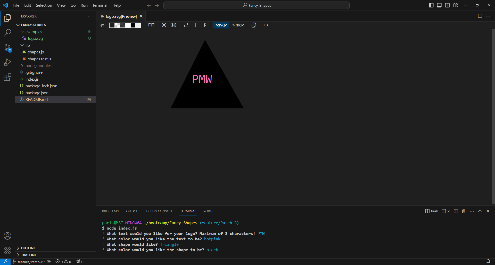

# Fancy-Shapes

## Description
Logos are unique symbols and designs used as icons to represent things. Sometimes getting started on designing a logo or graphic image could be a real challenge. Thats where Fancy-Shapes come into the picture! Fancy-Shapes is an easy to use application for creating graphic images using basic shapes such as square, circle, or triangle. 

## Installation
Installations required include:
- Node.js
- Inquirer
- Jest

## Usage
To use Fancy-Shapes, simply open the index.js file in the appropriate terminal or command line interface. Then, start the application by using "node index.js" and follow the prompts until completed. When the application is completed, logo.svg will be created within the examples folder. NOTE: It is important to read the prompts carefully. Inserting too many characters as text could cause the application to not generate an svg.file. An error message may also occur. Please see the link below to the example video for visual assistance. Have fun creating logos with Fancy-Shapes! 

## Link to video
https://drive.google.com/file/d/1siwnL7K2C4bRE8j1L4ir38y_PE8YEaSq/view?usp=sharing

## Screenshots
